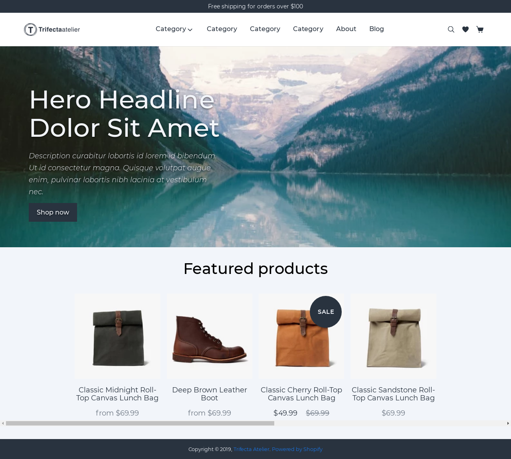
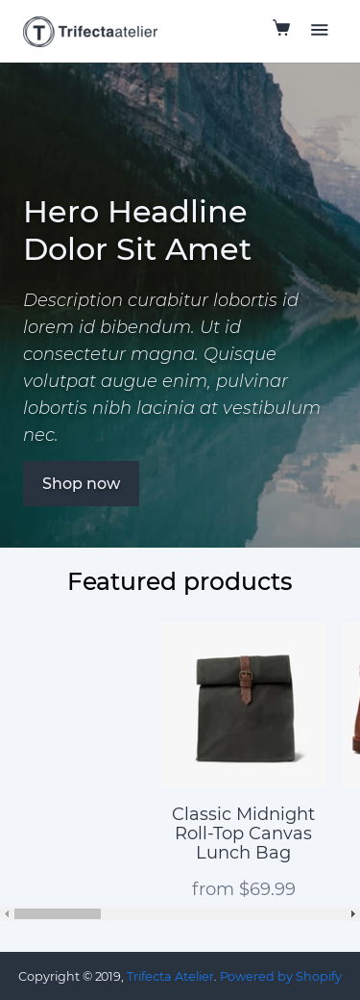

# @ryaninvents/taproom-sample

> Demo Shopify theme for Taproom 🙂





## System requirements

You'll want to ensure you have the following already installed on your local machine before getting started with Starter theme:

- **Node:** The current LTS (long-term support) release. We like to use a Node Version Manager like [NVM](https://github.com/creationix/nvm).

- **NPM 5+ or Yarn:** Both of these package managers have [ups and downs](https://blog.risingstack.com/yarn-vs-npm-node-js-package-managers/), choose whichever you prefer. Follow the installation instructions [for Yarn](https://yarnpkg.com/en/docs/install) or [NPM](https://www.npmjs.com/get-npm) to make sure you're using the latest version.

## Setting up SSL on Ubuntu

```bash
openssl req -x509 -out localhost.crt -keyout localhost.key \
  -newkey rsa:2048 -nodes -sha256 \
  -subj '/CN=localhost' -extensions EXT -config <( \
   printf "[dn]\nCN=localhost\n[req]\ndistinguished_name = dn\n[EXT]\nsubjectAltName=DNS:localhost\nkeyUsage=digitalSignature\nextendedKeyUsage=serverAuth")
```

## Running Cypress tests

```bash
# Make sure you've set up your `.env` file as necessary
npx gulp precypress
yarn test:e2e
```
